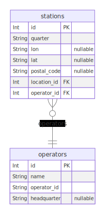
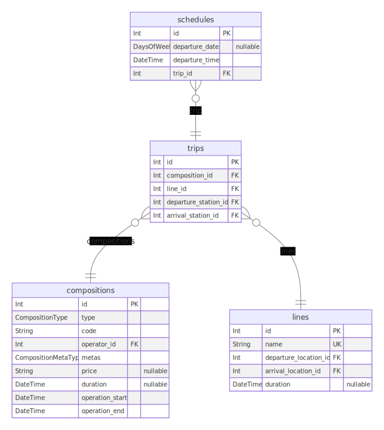
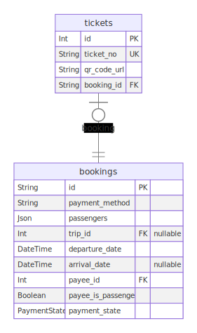
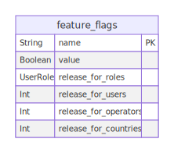

# Tri connect express
> Generated by [`prisma-markdown`](https://github.com/samchon/prisma-markdown)

- [Locales](#locales)
- [Users](#users)
- [Operators](#operators)
- [Trips](#trips)
- [Bookings](#bookings)
- [Technical](#technical)

## Locales

### `countries`
Country

Every countries that are managed in tri-connect-system.

All Applications should be deployed based on country.
Country is important to determine possible payment methods. [bookings.payment_method](#bookings), currencies,
languages and most importantly to find bus, trains or fly.

The Data use for this entity are coming from https://restcountries.com/

**Properties**
  - `name`: Country's name as Primary key
  - `currencies`: 
  - `languages`: 
  - `cca2`
    > Country code ISO 3166-1 alpha-2
    > For Example Cameroon -> CM
  - `cca3`
    > code ISO 3166-1 alpha-3.
    > For Example Cameroon -> CMR
  - `cioc`: code International Olympic Committee
  - `capital`: 
  - `continent`: 
  - `lat`: 
  - `lng`: 
  - `idd`: 
  - `utc`: 

### `locations`
Locations

`locations` is a entity that represent city, village, canton and all other possible jurical
entities that construct a country.

The Data use for this entity are coming from https://openstreetmap.com/

**Properties**
  - `id`: 
  - `name`: 
  - `postal_code`: 
  - `lon`: 
  - `lat`: 
  - `abbreviations`: 
  - `countryName`: 

## Users

### `users`

**Properties**
  - `id`: 
  - `first_name`: 
  - `last_name`: 
  - `email`: 
  - `auth_id`: 
  - `roles`: 
  - `location_id`: 

### `profiles`

**Properties**
  - `id`: 
  - `user_id`: 
  - `profile_picture`: 
  - `preferred_language`: 
  - `settings`: 

### `addresses`

**Properties**
  - `id`: 
  - `quarter`: 
  - `lon`: 
  - `lat`: 
  - `bp`: 
  - `city`: 
  - `user_id`: 

### `contacts`

**Properties**
  - `id`: 
  - `type`: 
  - `value`: 
  - `user_id`: 

## Operators

### `operators`

**Properties**
  - `id`: 
  - `name`: 
  - `operator_id`: 
  - `headquarter`: 

### `stations`

**Properties**
  - `id`: 
  - `quarter`: 
  - `lon`: 
  - `lat`: 
  - `postal_code`: 
  - `location_id`: 
  - `operator_id`: 

## Trips

### `compositions`

**Properties**
  - `id`: 
  - `type`: 
  - `code`: 
  - `operator_id`: 
  - `metas`: 
  - `price`: 
  - `duration`: 
  - `operation_start`: 
  - `operation_end`: 

### `schedules`

**Properties**
  - `id`: 
  - `departure_date`: 
  - `departure_time`: 
  - `trip_id`: 

### `trips`

**Properties**
  - `id`: 
  - `composition_id`: 
  - `line_id`: 
  - `departure_station_id`: 
  - `arrival_station_id`: 

### `lines`

**Properties**
  - `id`: 
  - `name`: 
  - `departure_location_id`: 
  - `arrival_location_id`: 
  - `duration`: 

## Bookings

### `bookings`

**Properties**
  - `id`: 
  - `payment_method`: 
  - `passengers`: 
  - `trip_id`: 
  - `departure_date`: 
  - `arrival_date`: 
  - `payee_id`: 
  - `payee_is_passenger`: 
  - `payment_state`: 

### `tickets`

**Properties**
  - `id`: 
  - `ticket_no`: 
  - `qr_code_url`: 
  - `booking_id`: 

## Technical

### `feature_flags`

**Properties**
  - `name`: 
  - `value`: 
  - `release_for_roles`: 
  - `release_for_users`: 
  - `release_for_operators`: 
  - `release_for_countries`: 